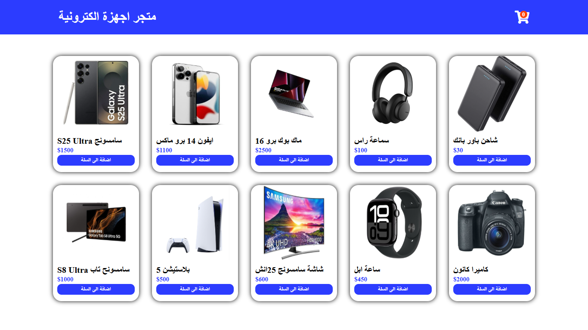

# 🛒 سلة المشتريات الإلكترونية (Electronics Products Cart)

## 📝 وصف المشروع
مشروع بسيط تم تطويره باستخدام **React** لمحاكاة **تجربة التسوق الإلكتروني**.  
يمكن للمستخدم استعراض قائمة المنتجات الإلكترونية، إضافة المنتجات إلى السلة، التحكم في كمياتها، وحذفها.  
كما يتم حساب **إجمالي السعر** بشكل تلقائي مع كل عملية إضافة أو حذف.

---

## ✨ مميزات المشروع
- 🛍️ **استعراض قائمة منتجات إلكترونية** مع الصورة والاسم والسعر.
- ➕ **إضافة المنتجات** إلى السلة بضغطة زر.
- 🔢 **تعديل الكمية** باستخدام أزرار `+` و `-`.
- 🗑️ **حذف منتج معين** من السلة.
- 🧹 **حذف جميع المنتجات** من السلة بضغطة واحدة.
- 💰 **حساب إجمالي السعر تلقائيًا** وتحديثه عند أي تعديل.
- 🖼️ **واجهة مستخدم تفاعلية وجذابة**:
  - أيقونة سلة في الهيدر يظهر فوقها **عدد المنتجات المضافة**.
  - نافذة منبثقة للسلة تظهر في منتصف الشاشة مع **تعتيم الخلفية**.
  - أزرار للتحكم الكامل في محتويات السلة.

---

## 🛠️ التقنيات المستخدمة
- ⚛️ **React.js**
- 🟨 **JavaScript (ES6+)**
- 🧩 **HTML5**
- 🎨 **CSS3**

---

## 🚀 تجربة المشروع
يمكنك تجربة المشروع مباشرة عبر GitHub Pages:  
[🔗 رابط التجربة](https://mohamed-baslib.github.io/electronics-products)

---

## 🧩 كيفية تشغيل المشروع محليًا

# استنساخ المشروع
git clone https://github.com/mohamed-baslib/electronics-products.git

# الدخول إلى مجلد المشروع
cd electronics-products

# تثبيت الحزم المطلوبة
npm install

# تشغيل المشروع محليًا
npm start

## 📄 ملاحظات

هذا المشروع يهدف إلى التدريب على React وإدارة الحالة في التطبيقات.

الكود منظم وبسيط ومناسب لفهم أساسيات بناء واجهة تسوق إلكترونية.

